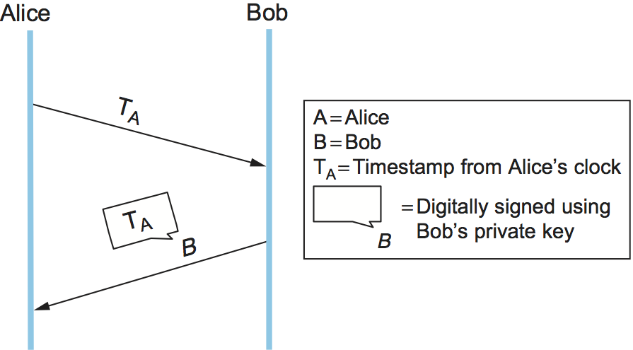
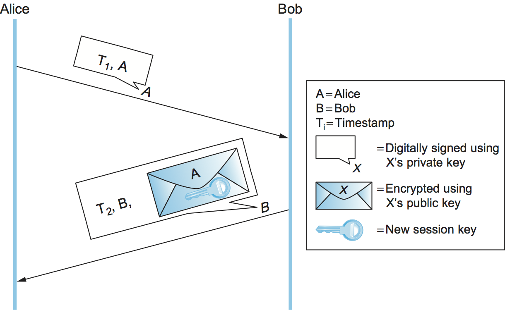
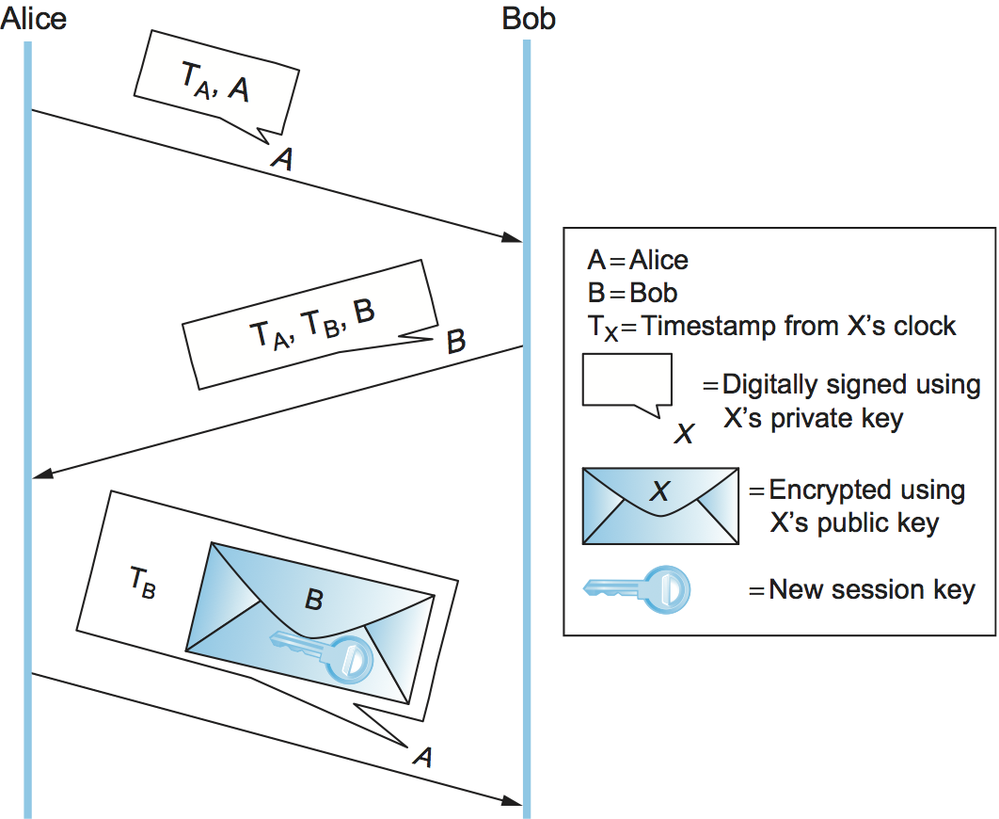

# {{Paj.Toe}}

我们描述了如何在第一部分中加密消息并建立验证器,以及如何在第二部分预分配必要的密钥. 似乎我们必须要做的是使协议安全的是向每个消息附加一个验证器,如果我们想要保密,加密消息. 

有两个主要原因,原因并不简单. 首先,存在一个问题*重放攻击*对手重新发送先前发送的消息的副本. 例如,如果消息是你放置在一个网站上的命令,那么重放的消息就会出现在网站上,就像你订购了更多一样. 即使它不是消息的原始化身,它的认证器仍然是有效的;毕竟,消息是由您创建的,并且它没有被修改. 在这种攻击的变种中*抑制重放攻击*对手可能只是延迟您的消息 (通过拦截和稍后重放它) ,以便在不再合适的时候接收它. 例如,对手可能会把你购买股票的订单从吉祥的时刻推迟到你不想购买的时刻. 虽然这个消息在某种意义上是原创的,但这并不及时. 独创性和及时性可以被认为是完整性的方面. 确保它们在大多数情况下都需要一个非平凡的ㄡ来回的协议. 

我们还没有解决的另一个问题是如何建立会话密钥. 会话密钥是在飞行中生成的对称密钥密码密钥,仅用于一个会话. 这也涉及到一个非平凡的协议. 

这两个问题的共同点是认证. 如果一条信息不具有原创性和及时性,那么从实用的角度来看,我们希望将其视为不真实,不是它声称来自谁. 而且,显然,当您安排与某人共享一个新的会话密钥时,您希望知道您正在与正确的人共享它. 通常,身份验证协议同时建立会话密钥,这样在协议结束时,Alice和Bob已经相互身份验证,并且它们可以使用新的对称密钥. 如果没有新的会话密钥,协议将只在一个时间点对Alice和Bob进行身份验证;会话密钥允许它们有效地对后续消息进行身份验证. 一般来说,会话密钥建立协议执行身份验证 (一个显著的例外是.ie-Hellman,如下所述,因此术语*认证协议*和*会话密钥建立协议*几乎是同义词. 

有一套核心技术用于确保认证协议的独创性和及时性. 我们描述这些技术之前,移动到特定的协议. 

## 独创性与时效性技术

我们已经看到,认证者不能使我们能够检测出原始或及时的消息. 一种方法是在消息中包括时间戳. 显然,时间戳本身必须是防篡改的,因此它必须被认证器覆盖. 时间戳的主要缺点是它们需要分布式时钟同步. 由于我们的系统将依赖于同步,因此除了时钟同步的常见挑战之外,时钟同步本身还需要防范安全威胁. 另一个问题是分布式时钟同步到某一程度,误差一定的范围. 因此,时间戳提供的时序完整性仅与同步程度一样好. 

另一种方法是包括*临时工*-在消息中只使用一次的随机数. 然后,参与者可以通过检查以前是否使用过随机数来检测重放攻击. 不幸的是,这需要跟踪过去的无意识,其中很多都是可以积累的. 一种解决方案是结合使用时间戳和nonces,从而只需要在一定时间跨度内使nonce是唯一的. 这使得确保NECES的唯一性可管理,而只需要时钟的松散同步. 

另一种解决时间戳和NoCES缺陷的方法是使用其中的一个或两个*挑战应对*协议. 假设我们使用时间戳. 在询问-响应协议中,Alice向Bob发送时间戳,询问Bob在响应消息中对其进行加密 (如果他们共享对称密钥) 或者在响应消息中对其进行数字签名 (如果Bob具有公钥,如[图1](#challenge-response)) 加密的时间戳就像认证器,同时证明了时效性. Alice可以在Bob的响应中轻松地检查时间戳的及时性,因为该时间戳来自Alice自己的时钟ℴℴ不需要分布式时钟同步. 假设该协议使用UNCES. 然后,Alice只需要跟踪那些当前响应非常优秀,并且响应时间不长的nonces;任何声称的带有未识别的nonce的响应都必须是伪造的. 

<figure class="line">
	
	
	<figcaption>A challenge-response protocol.</figcaption>
</figure>

挑战-响应的美妙之处在于,它结合了及时性和认证;毕竟,只有Bob (如果它是对称密钥密码,可能还有Alice) 知道加密从未见过的时间戳或随机数所必需的密钥. 在随后的大多数认证协议中使用时间戳或NoCES. 

## 公钥认证协议

在下面的讨论中,我们假设Alice和Bob的公钥已经通过某种方式 (如PKI) 相互预定义了. 我们的意思是包括Alice在给Bob的第一条消息中包括她的证书的情况,以及Bob在接收到Alice的第一条消息时搜索关于Alice的证书的情况. 

<figure class="line">
	
	
	<figcaption>A public-key authentication protocol that depends on
	synchronization.</figcaption>
</figure>

第一个协议 ([图2](#pKAuthSync)依赖于爱丽丝和鲍伯的时钟同步. 爱丽丝发送一个带有时间戳的消息,她的身份在明文加上她的数字签名. 鲍伯使用数字签名来验证消息和时间戳以验证其新鲜度. Bob返回一个带有时间戳的消息,并且他的身份是明文的,以及一个使用Alice的公钥加密 (为了保密) 的新会话密钥,所有这些都是数字签名的. 爱丽丝可以验证消息的真实性和新鲜度,所以她知道她可以信任新的会话密钥. 为了处理不完美的时钟同步,时间戳可以用NoCES扩充. 

第二协议 (第二协议) [图3](#pKAuthNoSync)相似但不依赖于时钟同步. 在该协议中,爱丽丝再次向鲍伯发送带有时间戳和身份的数字签名消息. 因为他们的时钟不同步,鲍伯无法确定消息是新鲜的. 鲍伯用爱丽丝的原始时间戳ㄡ他自己的新的时间戳和他的身份发送一个数字签名的消息. 爱丽丝可以通过与鲍伯的时间戳比较来验证她的回答是否新鲜. 然后,她用原始的时间戳和使用鲍伯公钥加密的新会话密钥向Bob发送一个数字签名的消息. Bob可以验证消息的新鲜度,因为时间戳来自他的时钟,所以他知道他可以信任新的会话密钥. 时间戳本质上是方便的NoCES,并且实际上这个协议可以使用NOCES代替. 

<figure class="line">
	
	
	<figcaption>A public-key authentication protocol that does not
	depend on synchronization. Alice checks her own timestamp against
	her own clock, and likewise for Bob.</figcaption>
</figure>

## 对称密钥认证协议

只有在相当小的系统中,将对称密钥预分配到每对实体才是可行的. 我们关注的是更大的系统,每个实体都有自己的系统. *主密钥*只与密钥分发中心 (KDC) 共享. 在这种情况下,基于对称密钥的认证协议涉及三方: 爱丽丝ㄡ鲍伯和KDC. 身份验证协议的最终产品是在Alice和Bob之间共享的会话密钥,它们将使用它们直接通信,而不涉及KDC. 

<figure class="line">
	
	
	<figcaption>The Needham-Schroeder authentication protocol.</figcaption>
</figure>

Needham Schroeder认证协议在[图4](#needhamSchroeder). 请注意,KDC实际上不验证爱丽丝的初始消息,并且根本不与鲍伯通信. 相反,KDC使用它对Alice和Bob的主密钥的知识来构造一个除了Alice之外的任何人都无用的回复 (因为只有Alice能够解密它) ,并且包含Alice和Bob自己执行身份验证协议其余部分的必要成分. 

在前两个信息中的随机性是为了保证爱丽丝KDC的回复是新鲜的. 第二个和第三个消息包括新会话密钥和爱丽丝的标识符,使用鲍伯的主密钥将其加密在一起. 它是一种公钥证书的对称密钥版本;它实际上是KDC签署的声明 (因为KDC是除了知道Bob主密钥的Bob之外的唯一实体) ,所附的会话密钥由Alice和Bob拥有. 虽然前两个消息中的nonce旨在向Bob保证第三个消息是新的,但是这种推理存在一个缺陷. 

### 科贝罗斯

Kerberos是一种基于Needham Schroeder协议的认证系统,专门用于客户机/服务器环境. 最初在麻省理工学院开发,它已被IETF标准化,可作为开源和商业产品. 我们将在这里关注Kerberos的一些有趣的创新. 

Kerberos客户端通常是人类用户,用户使用密码进行身份验证. 爱丽丝的主密钥,与KDC共享,是从她的密码中导出的,如果你知道密码,你可以计算密钥. Kerberos假设任何人都可以物理地访问任何客户机;因此,将Alice的密码或主密钥的暴露最小化不仅在网络中,而且在她登录的任何机器上也是很重要的. Kerberos利用Needham Schroeder来实现这一目标. 在Needham Schroeder中,爱丽丝唯一需要使用密码的时候是解密KDC的回复. Kerberos客户端软件等待KDC的应答到达,提示Alice输入她的密码,计算主密钥并解密KDC的应答,然后擦除关于密码和主密钥的所有信息,以使其暴露最小化. 还要注意,用户看到Kerberos的唯一标志是提示用户输入密码. 

在Needham-Schroeder中,KDC对Alice的答复扮演了两个角色: 它为她提供了证明身份的手段 (只有Alice可以解密答复) ,并且它为她提供了某种对称密钥证书或"票据"以向Bob-session密钥和Alliice的标识符进行呈现,使用Bob的主机k加密哎呀. 在Kerberos中,这两个函数和KDC本身实际上是分开的 ([图5](#kerberos)) 一个名为身份验证服务器 (AS) 的可信服务器扮演了第一个KDC角色,它为Alice提供她可以用来证明身份的东西ℴℴ这次不是给Bob,而是给第二个名为Ticket Granting Server (TGS) 的可信服务器. TGS扮演第二KDC角色,用爱丽丝给鲍伯的一张票回复她. 这个方案的吸引力在于,如果Alice需要与几个服务器通信,而不仅仅是Bob,那么她可以从TGS获得每个服务器的票,而不必返回AS. 

<figure class="line">
	
	
	<figcaption>Kerberos authentication.</figcaption>
</figure>

在打算使用Kerberos的客户机/服务器应用程序域中,假设一定程度的时钟同步是合理的. 这允许Kerberos使用时间戳和生命周期来代替Needham-Shroeder的nonces,从而消除了练习4中探索的Needham-Schroeder安全弱点. Kerberos支持各种加密算法,包括散列SHA-1和MD5以及对称密钥密码AESㄡ3DES和DES. 

## Diffie-Hellman密钥协定

Diffie-Hellman密钥协商协议在不使用任何预分配密钥的情况下建立会话密钥. 爱丽丝和鲍勃之间交换的消息可以被任何能够窃听的人读取,但是窃听者不知道爱丽丝和鲍勃最终使用的会话密钥. 另一方面,Diffie Hellman没有对参与者进行认证. 由于在没有确定与谁进行通信的情况下进行安全通信很少有用,所以.ie-Hellman通常以某种方式增强以提供身份验证. .ie-Hellman的主要用途之一是在Internet密钥交换(IKE)协议中,它是IP安全(IPsec)体系结构的中心部分. 

.ie-Hellman协议有两个参数$$p$$和$$g$$,这两个参数都是公共的,并且可以被特定系统中的所有用户使用. 参数$p$$必须是质数. $bmod p$$ (模数$$p$$) 的整数是$0$到$p-1$$$,因为$$xbmod p$$是$x$$除以$p$$之后的余数,数学家称之为$p$$$. *组*乘法运算. 参数$$$$ (通常称为生成器) 必须是*本原根*$$$$: 对于每一个$$$$从1到$$P-1 $$必须有一些价值$K $ $$这样$n=g^ k\\bMOD P$$. 例如,如果$$p$$是素数5 (实际系统将使用更大的数字) ,那么我们可以选择2作为生成器$$g$$,因为: 

1美元= 2 ^ 0 \\ BMOD P$$

2美元= 2 ^ 1 \\ BMOD P$$

3美元= 2 ^ 3 \\ BMOD P$$

4美元= 2 ^ 2 \\ BMOD P$$

假设爱丽丝和鲍伯希望在共享对称密钥上达成一致. 爱丽丝和鲍伯,以及其他所有人,已经知道$$$$和$$$$的价值. 爱丽丝生成一个随机的私有值$$$,鲍伯生成一个随机的私有值$$$$ $. $$$和$B$$都是从$$的整数集合中提取的. {1,$$ⅆⅆ$P-1}美元. 爱丽丝和鲍伯推导出它们对应的公共值,它们将按如下方式互不加密地发送给彼此的值. 爱丽丝的公共价值

$g^ a\\bMOD P$$

鲍伯的公共价值是

$G^ B\\BMOD P$$

然后他们交换他们的公共价值. 最后,爱丽丝计算

$g^ {ab}\\bMOD p= (g^ b\\bMOD p) ^ a\\bMOD p$$

鲍伯计算

$G^ {Ba}\\ BMOD p= (g^ a\\bMOD p) ^ b\\bMOD P.$$

爱丽丝和鲍伯现在有$G^ {ab}\\bMOD P$$ (等于$G^ {Ba}\\bMOD P$ $) 作为它们共享的对称密钥. 

任何窃听者都知道$P,G $,和两个公共价值$g^ a \\ bMOD P$ $和$g^ b\\bMOD P$ $. 如果窃听者可以确定$$ $$或$$$ $,她可以很容易地计算得到的密钥. 然而,根据该信息确定$a$或$b$$在计算上是不可行的,对于适当大的$p,a$$和$b$$;它被称为*离散对数问题*.

另一方面,也存在着Diffie Hellman缺乏认证的问题. 一个可以利用这一点的攻击是*中间人攻击*. 假设Mallory是一个具有拦截消息能力的对手. Mallory已经知道$p$和$g$,因为它们是公共的,并且她生成随机的私有值$c$和$d$,分别用于Alice和Bob. 当爱丽丝和鲍伯互相传递他们的公共价值时,Mallory拦截他们并发送自己的公共价值,如[图6](#manInTheMiddle). 结果是,爱丽丝和鲍伯每个人最终都不知不觉地与Mallory分享了一把钥匙,而不是彼此分享. 

<figure class="line">
	
	
	<figcaption>A man-in-the-middle attackn.</figcaption>
</figure>

Diffie-Hellman的变体有时被称为*固定Diffie Hellman*支持一个或两个参与者的身份验证. 它依赖于与公钥证书类似的证书,但是相反,它验证实体的.ie-Hellman公共参数. 例如,这样的证书将声明Alice的.ie-Hellman参数是$ p,g$$,和$$g^abmod p$ (注意,$a$$的值仍然只有Alice知道) . 这样的证书将使Bob确信.ie-Hellman中的其他参与者是Alice,否则其他参与者将无法计算密钥,因为她不知道$a$$. 如果两个参与者都有他们的Diffie-Hellman参数的证书,他们可以相互认证. 如果只有一个证书,那么只有一个可以被认证. 这在某些情况下是有用的;例如,当一个参与者是Web服务器,而另一个参与者是任意客户端时,客户端可以在向Web服务器发送信用卡号码之前对Web服务器进行身份验证并建立用于保密的会话密钥. 
