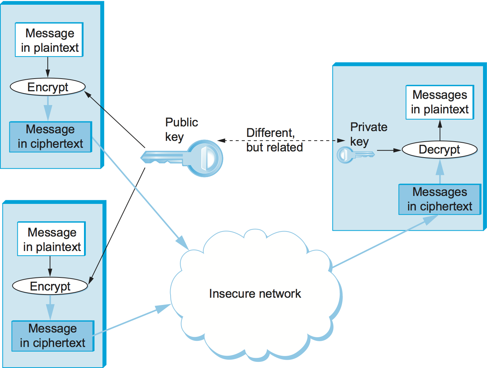
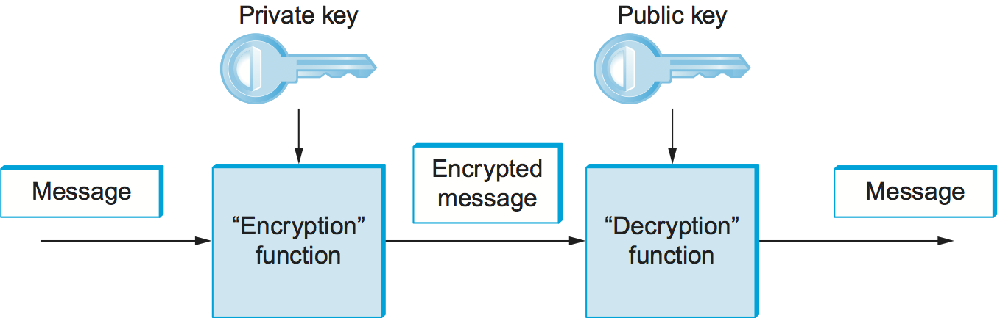
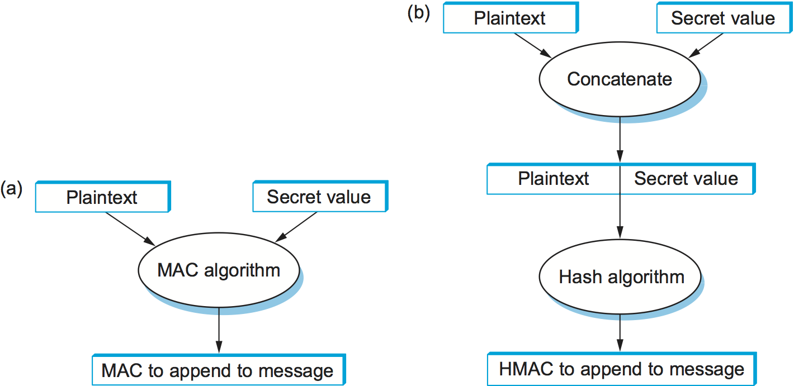

# {{Paj.Toe}}

我们逐步介绍基于密码的安全性的概念. 第一步是在本节中介绍的密码算法密码和密码散列. 它们本身不是一个解决方案,而是构建一个解决方案的构建块. 密码算法由参数化*钥匙*,后面的部分将解决分发密钥的问题. 在下一步中,我们将描述如何将加密构建块合并到协议中,这些协议在拥有正确密钥的参与者之间提供安全通信. 最后一节然后检查当前使用的几个完整的安全协议和系统. 

## 密码原理

加密以这样一种方式转换消息,使得没有如何逆转转换的秘密的任何一方都无法理解它. 发送者应用*加密*原函数*明文*消息,导致*密文*通过网络发送的消息,如图所示[图1](#genericCrypto). 接收者应用秘密*解密*函数的逆函数加密恢复原始明文. 假设窃听者不知道解密功能,则通过网络传输的密文对于任何窃听者来说都是不可理解的. 由加密函数及其对应的解密函数表示的变换称为*密码*.

<figure class="line">
	
	
	<figcaption>Symmetric-key encryption and decryption.</figcaption>
</figure>

1883年,密码学家首先提出了加密和解密函数应该由*钥匙*此外,职能应被视为公众的知识,只有关键是需要保密的. 因此,对于给定明文消息产生的密文取决于加密函数和密钥. 这个原则的一个原因是,如果你依赖密码被保密,那么当你相信它不再是秘密时,你就必须撤消密码 (不仅仅是密钥) . 这意味着潜在的频繁变化的密码,这是有问题的,因为它需要大量的工作来开发一个新的密码. 此外,了解密码是否安全的最好方法之一是长时间使用它ℴℴ如果没有人破坏它,那么它可能是安全的.  (幸运的是,有很多人会尝试破译密码,并且当他们成功时让密码广为人知,所以没有消息通常是好消息. ) 因此,部署新密码有相当大的成本和风险. 最后,用密钥参数化密码为我们提供了实际上非常大的一族密码;通过交换密钥,我们基本上交换了密码,从而限制了*密码分析器* (代码破解) 可以用来破解我们的密钥/密码,如果她成功,她可以读取的数量. 

加密算法的基本要求是将明文转换为密文,这样只有预期的接收者ℴℴ解密密钥的持有者ℴℴ才能恢复明文. 这意味着加密的消息不能被不持有密钥的人读取. 

重要的是要认识到,当一个潜在的攻击者接收到一段密文时,他可能拥有比密文本身更多的信息. 例如,他可能知道明文是用英文写的,这意味着信. *e*明文比其他任何字母更常见;许多其他字母和普通字母组合的频率也可以预测. 这些信息可以大大简化找到密钥的任务. 类似地,他可能知道消息的可能内容;例如,单词"login"可能出现在远程登录会话的开始. 这可能使A*已知明文*攻击,它的成功几率比*仅密文*攻击. 更好的是*选择明文攻击*攻击,可以通过将一些信息馈送给发送方而启用,您知道发送方可能发送这些信息,例如,这些事件在战时发生. 

因此,最好的密码算法可以防止攻击者推断密钥,即使个人既知道明文又知道密文. 这使得攻击者别无选择,只能尝试所有可能的密钥穷尽,"蛮力"搜索. 如果键有$n$$位,那么对于键有2$^n$$的可能值 (每个$n$$位可以是零也可以是1) . 攻击者可能很幸运,可以立即尝试正确的值,或者很不幸,在最终尝试密钥的正确值之前,尝试了所有2$^n$$的可能值;发现正确值的猜测的平均次数介于这些ext之间ReMES,2美元$N $ $ / 2. 这可以通过选择足够大的密钥空间并使检查密钥的操作成本合理而变得在计算上不切实际. 这使得计算速度不断增加,使得以前不可行的计算变得可行. 此外,虽然我们正集中注意数据在网络中移动时的安全性,也就是说,数据有时仅在短时间内易受攻击,但一般来说,安全人员必须考虑需要存储在数十年档案中的数据的脆弱性. 这是一个巨大的关键尺寸. 另一方面,较大的密钥使得加密和解密速度变慢. 

大多数密码是*分组密码*它们被定义为输入一个固定大小的明文块,通常为64到128位. 使用块密码对每个块进行独立加密*电子码本 (ECB) 模式*加密有一个缺点,即给定的明文块值总是会导致同一个密文块. 因此,明文中的循环块值在密文中也是可识别的,这使得密码分析员破译密码更加容易. 

为了防止这一点,块密码总是被扩充以使块的密文随上下文而变化. 可以增加块密码的方式. *运行方式*. 一种常用的操作方式是*密码块链接* (CBC) ,其中每个明文块在加密前与前一个块的密文xOxD. 结果是,每个块的密文部分地依赖于前面的块 (即,在其上下文中) . 由于第一个明文块没有前面的块,所以它是带有随机数的XORed. 那个随机数,叫做*初始化向量* (iv) 包含在一系列密文块中,使得第一密文块可以被解密. 这种模式在[图2](#cbc). 另一种操作模式是*计数器模式*其中,计数器的连续值 (例如,1ㄡ2ㄡ3ㄡ$ldots$$) 被合并到明文的连续块的加密中. 

<figure class="line">
	
	
	<figcaption>Cipher Block Chaining.</figcaption>
</figure>

## 对称密钥密码

在对称密钥密码中,通信中的两个参与者共享相同的密钥. 换句话说,如果使用特定密钥对消息进行加密,则需要相同密钥来解密消息. 如果密码显示在[图1](#genericCrypto)是对称密钥密码,那么加密和解密密钥将是相同的. 对称密钥密码也被称为秘密密钥密码,因为共享密钥必须只对参与者知道.  (稍后我们将看另一种公开密钥密码. ) 

> 我们使用这个词*参与者*对于参与安全通信的各方来说,因为这是我们在整个书中一直使用的术语,用于标识通道的两个端点. 在安全领域中,它们通常被称为*校长*.

美国国家标准与技术研究所 (NIST) 发布了一系列对称密钥密码的标准. *数据加密标准* (DES) 是第一个,它经受住了时间的考验,因为还没有发现比暴力搜索更好的密码分析攻击. 然而,蛮力搜索的速度越来越快. DES的密钥 (56个独立位) 现在给定的处理器速度太小. DES密钥具有56个独立的位 (尽管它们总共有64个比特;每个字节的最后一个比特是奇偶校验位) . 如上所述,平均而言,您需要搜索2$^{56}$$可能键的一半空间才能找到正确的键,给出2$^{55}$==3.6$乘以$$$$$$$$^{16}$$键. 这听起来好像很多,但是这样的搜索是高度并行的,所以你可以投入尽可能多的计算机来完成任务ℴℴ而且现在很容易就能将手放在成千上万台计算机上 (例如,Amazon.com会以每小时几分钱的价格租给你) . 到了90年代末,几小时后就可以恢复DES密钥了. 因此,NIST在1999更新DES标准以指示DES只应用于遗留系统. 

NIST也规范了密码*三重DES* (3DES) ,它利用DES的密码分析电阻,实际上增加了密钥大小. 3DES密钥有168 (=3$$乘以$56) 个独立位,用作三个DES密钥;我们称它们为DES-key1ㄡDES-key2和DES-key3. 块的3DES加密是通过DES加密的第一DES加密的,然后DES加密. *判定元件*使用DEX-KEY2对结果进行加密,最后用DESKEY3加密DES. 解密涉及使用DES-KEY3解密,然后使用DEX-KEY2加密,然后使用DES-KEY1解密. 

> 3DES加密使用DES的原因*判定元件*DESC-KEY2的加密与传统DES系统互操作. 如果传统DES系统使用单个密钥,那么3DES系统可以通过为DES-key1ㄡDES-key2和DES-key3中的每一个使用该密钥来执行相同的加密功能;在前两个步骤中,我们使用相同的密钥进行加密和解密,生成原始明文,然后对原始明文进行加密增益. 

虽然3DES解决了DES的密钥长度问题,但它继承了一些其他缺点. DES/3DES的软件实现是缓慢的,因为它最初是由IBM设计的,用于在硬件中实现. 此外,DES/3DES使用64位块大小;更大的块大小更有效和更安全. 

3DES正在被*高级加密标准* (AES) 标准由NIST于2001发布. 被选择成为该标准的密码 (稍加修改) 最初基于其发明者Daemen和Rijmen的名字命名为Rijndael (发音大致类似于"Rhine dahl") . AES支持128, 192或256位的密钥长度,并且块长度为128位. AES允许在软件和硬件中快速实现. 它不需要太多的内存,这使得它适合于小型移动设备. AES具有一些经数学证明的安全特性,并且截至编写本文时,还没有遭受任何显著的成功攻击. 

> 由于任何能够以比纯粹的蛮力更小的计算量来恢复明文的技术都被归类为攻击,所以已经公开了对AES的一些形式的攻击. 虽然它们做得比蛮力好,但计算上仍然非常昂贵. 

## 公钥密码

对称密钥密码的替代方案是非对称的或公钥密码. 公钥密码不是由两个参与者共享的单个密钥,而是使用一对相关密钥,一个用于加密,另一个用于解密. 这对钥匙只有一个参与者"拥有". 所有者保留解密密钥的秘密,以便只有所有者可以解密消息;该密钥被称为*私钥*. 所有者将加密密钥公开,以便任何人都可以为所有者加密消息;该密钥被称为*公钥*. 显然,对于这样一种工作方案,必须不可能从公钥中推断私钥. 因此,任何参与者都可以获得公钥并向密钥的所有者发送加密消息,并且只有所有者具有解密密钥所必需的私钥. 这个场景描述在[图3](#public).

<figure class="line">
	
	
	<figcaption>Public-key encryption.</figcaption>
</figure>

因为这有点不直观,所以我们强调公共加密密钥对于解密消息是没有用的ℴℴ您甚至不能解密您自己刚刚加密的消息,除非您拥有私有解密密钥. 如果我们认为密钥定义了参与者之间的通信信道,那么公钥密码和对称密钥密码的另一个区别是信道的拓扑. 对称密钥密码的密钥提供了在两个参与者之间双向的通道,每个参与者持有相同的 (对称) 密钥,任何人都可以使用该密钥来加密或解密任何方向的消息. 相反,公钥/私钥对提供了从具有公钥的每个人到私钥的 (唯一的) 所有者的单向和多对一的通道,如[图3](#public).

公钥密码的一个重要附加特性是,私有"解密"密钥可以与加密算法一起用于对消息进行加密,从而只能使用公共"加密"密钥对消息进行解密. 这个属性显然不会对机密性有用,因为任何具有公钥的人都可以解密这样的消息.  (实际上,对于两个参与者之间的双向机密性,每个参与者需要自己的密钥对,并且每个参与者使用对方的公钥对消息进行加密. ) 然而,这个属性对于身份验证是有用的,因为它告诉接收者这样的消息只能创建它由钥匙的所有者 (按某些假设,我们稍后会进入) . 这说明了[图4](#pksign). 从图中应该可以清楚地看到,任何具有公钥的人都可以对加密的消息进行解密,并且假定解密的结果与预期的结果匹配,则可以得出结论,必须使用私钥来执行加密. 确切地说,如何使用这个操作来提供身份验证是后面一节的主题. 正如我们将看到的,公钥密码主要用于身份验证和保密地分发对称密钥,其余的机密性留给对称密钥密码. 

<figure class="line">
	
	
	<figcaption>Authentication using public keys.</figcaption>
</figure>

有一段有趣的历史: 公钥密码的概念首先在1976由Diffie-Hellman出版. 然而,随后的文件已经证明,英国的通信电子安全小组已经发现了1970的公开密钥密码,而美国国家安全局 (NSA) 声称在20世纪60年代中期发现了这些密码. 

最著名的公钥密码是RSA,以其发明者的名字命名: RiestRead,夏米尔和Adleman. RSA依赖于大数分解的高计算成本. 找到一个有效的方法来计算数的问题是数学家们在RSA在1978出现很久之前就没有成功的,RSA随后对密码分析的抵抗进一步增强了对其安全性的信心. 不幸的是,RSA需要相对大的密钥,至少1024位,以确保安全. 这比对称密钥密码的密钥要大,因为通过分解密钥对所基于的大量数字比通过穷举搜索密钥空间更快地破坏RSA私钥. 

另一个公钥密码是ElGamal. 与RSA一样,它依赖于一个数学问题,即离散对数问题,没有找到有效的解决方案,并且需要至少1024位的密钥. 当输入是椭圆曲线时,会出现一种离散对数问题的变化,这被认为更加难以计算;基于此问题的密码方案称为*椭圆曲线密码体制*.

不幸的是,公钥密码比对称密钥密码要慢几个数量级. 因此,对称密钥密码用于绝大部分加密,而公钥密码用于认证和会话密钥建立. 

## 认证装置

仅加密不能提供数据完整性. 例如,仅仅随机修改一个密文消息就可以将其转换成解密为看起来有效的明文的东西,在这种情况下,接收者将无法检测到篡改. 加密本身也不提供认证. 如果消息内容在参与者创建之后已经被修改,那么说消息来自某个参与者是没有用的. 从某种意义上说,诚信和认证是根本不可分割的. 

安*认证器*是包含在发送的消息中的值,该值可用于同时验证消息的真实性和数据完整性. 我们将看到如何在协议中使用验证器. 现在,我们专注于生成认证器的算法. 

您应该还记得,在前面的章节中,我们讨论了校验和和循环冗余校验 (CRC) ℴℴ与原始消息一起发送的附加信息ℴℴ作为检测消息何时被误码修改的方法. 类似的概念也适用于身份验证器,还有一个额外的挑战,即消息的损坏很可能是由希望该损坏未被检测到的人故意执行的. 为了支持身份验证,身份验证器包括一些证据,证明创建身份验证器的人知道只有消息所指称的发送者才知道的秘密;例如,秘密可以是密钥,并且证明可以是使用密钥加密的某个值. 冗余信息的形式与秘密知识的证明形式之间存在着相互依赖关系. 我们讨论几种可行的组合. 

我们最初假设原始消息不必保密,所发送的消息将包含原始消息的明文加验证器. 以后我们会考虑保密的情况. 

一种认证器结合加密和A*加密哈希函数*. 密码散列算法被视为公共知识,与密码算法一样. 一个加密散列函数 (也称为*密码校验和*是输出关于消息的足够冗余信息以揭露任何篡改的函数. 正如校验和或CRC公开由噪声链接引入的比特错误一样,密码校验和被设计成公开对手故意的消息损坏. 它输出的值称为*消息摘要*并且,像普通的校验和一样,附加到消息中. 由给定散列产生的所有消息摘要都具有相同的比特数,而不管原始消息的长度. 由于可能的输入消息的空间大于可能的消息摘要的空间,将有不同的输入消息产生相同的消息摘要,如哈希表中的冲突. 

可以通过加密消息摘要来创建验证器. 接收方计算消息的明文部分的摘要,并将其与解密的消息摘要进行比较. 如果它们是相等的,那么接收方将断定消息确实来自其所声称的发送者 (因为它必须被用正确的密钥加密) 并且没有被篡改. 没有对手可以逃脱发送带有匹配的伪摘要的伪消息,因为她没有密钥来正确加密伪摘要. 然而,攻击者可以通过窃听获得明文原始消息及其加密摘要. 然后,对手可以 (因为哈希函数是公共知识) 计算原始消息的摘要,并生成寻找具有相同消息摘要的替代消息. 如果她找到了一个,她就无法用旧的认证者发送新的信息. 因此,安全性要求散列函数具有*单向的*属性: 对手必须无法在计算上找到与原始消息具有相同摘要的任何明文消息. 

对于满足此要求的散列函数,其输出必须是随机分布的. 例如,如果摘要有128位长,并且是随机分布的,那么您平均需要尝试2$^{127}$$消息,然后才能找到与给定消息的摘要匹配的第二条消息. 如果输出不是随机分布的,也就是说,如果一些输出比其他输出更可能分布,那么对于一些消息,您可以更容易地找到具有相同摘要的另一条消息,这将降低算法的安全性. 如果你只是试图找到任何*碰撞*-产生相同摘要的任何两个消息-那么平均只需要计算2$^{64}$$消息的摘要. 这个令人惊讶的事实是"生日攻击"的基础ℴℴ更多细节参见练习. 

有几种常见的加密哈希算法,包括消息摘要5 (MD5) 和安全散列算法1 (SHA-1) . MD5输出128位摘要,SHA-1输出160位摘要. MD5的弱点已经知道了一段时间,这导致建议从MD5转移到SHA-1. 最近,研究人员发现了一些技术,发现SHA-1碰撞比蛮力更有效,但它们在计算上还不可行. 虽然*碰撞攻击* (基于发现任何碰撞的攻击) 并不是一个很大的风险. *原像攻击* (基于找到与给定的第一个消息冲突的第二个消息的攻击) ,这些仍然是严重的弱点. NIST建议逐步淘汰SHA-1 2010,有利于四个SHA的变体,统称为SHA-2. 有一个持续的竞争,设计一个新的散列被称为SAH-3. 

当生成加密的消息摘要时,摘要加密可以使用对称密钥密码或公钥密码. 如果使用公钥密码,则将使用发送方的私钥 (我们通常认为用于解密的密钥) 对摘要进行加密,并且接收方 (或任何其他人) 可以使用发送方的公钥对摘要进行解密. 

使用公钥算法加密但使用私钥加密的摘要称为*数字签名*因为它提供了不可否认的书面签名. 带有数字签名的消息的接收方可以向任何第三方证明发送方确实发送了该消息,因为第三方可以使用发送方的公钥自己进行检查.  (摘要的对称密钥加密不具有此属性,因为只有两个参与者知道密钥;此外,由于两个参与者都知道密钥,因此所声称的接收者可能自己创建了消息. ) 任何公钥密码都可以用于数字签名. *数字签名标准* (DSS) 是由NIST标准化的数字签名格式. DSS签名可以使用三个公钥密码中的任何一个,一个基于RSA,另一个在ElGamal上,第三个称为*椭圆曲线数字签名算法*.

另一种身份验证器是类似的,但是它使用类似散列的函数作为参数 (只有发送方和接收方知道) ,而不是对散列进行加密,如下所示[图5](#macAndHmac). 这样的函数输出一个称为*消息认证码* (MAC) . 发送者将MAC附加到她的明文消息中. 接收机使用明文和秘密值重新计算MAC,并将重新计算的MAC与接收到的MAC进行比较. 

<figure class="line">
	
	
	<figcaption>Computing a MAC (a) versus computing an HMAC (b).</figcaption>
</figure>

MAC的一个常见变体是将加密散列 (例如MD5或SHA-1) 应用于明文消息和秘密值的连接,如下所示[图5](#macAndHmac). 由此产生的摘要称为*散列消息认证码* (HMAC) 因为它本质上是一个MAC. HMAC,而不是秘密值,被附加到明文,只有知道秘密值的接收机才能计算正确的HMAC,以便与接收的HMAC进行比较. 如果不是针对散列的单向属性,则对手可能能够找到生成HMAC的输入,并将其与明文消息进行比较,以确定秘密值. 

到目前为止,我们一直假设消息不是机密的,所以原始消息可以作为明文发送. 为了向具有身份验证器的消息添加机密性,对包括其身份验证器 (MACㄡHMAC或加密摘要) 在内的整个消息的连接进行加密就足够了. 请记住,在实践中,使用对称密钥密码实现机密性,因为它们比公钥密码快得多. 此外,在加密中包括认证器成本很低,并且增加了安全性. 一个常见的简化方法是使用消息的 (原始) 摘要对消息进行加密,使得该摘要仅加密一次;在这种情况下,整个密文消息被认为是一个验证器. 

虽然身份验证器似乎可以解决身份验证问题,但是在后面的部分中我们将看到,它们只是解决方案的基础. 然而,首先,我们要解决参与者如何获得密钥的问题. 
