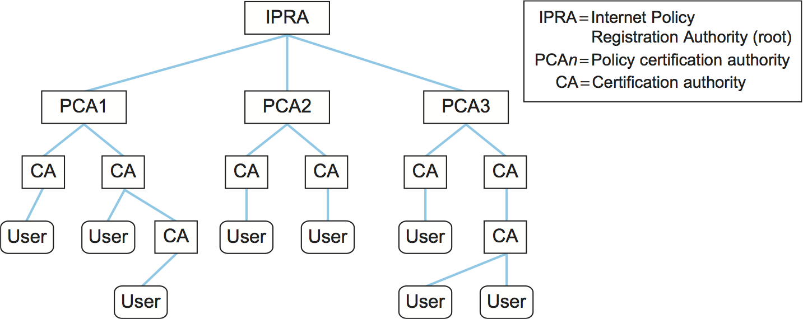

# {{Paj.Toe}}

为了使用密码和认证,通信参与者需要知道使用什么密钥. 在对称密钥密码的情况下,一对参与者如何获得它们共享的密钥?在公钥密码的情况下,参与者如何知道公钥属于某个参与者?答案取决于密钥是否是短命的. *会话密钥*或更长的寿命*预分配密钥*.

会话密钥是用于确保单个ㄡ相对短的通信片段的密钥: 会话. 一对参与者之间的每个不同的会话使用新的会话密钥,该会话密钥始终是速度的对称密钥. 参与者通过协议-会话密钥建立协议来确定使用什么会话密钥. 会话密钥建立协议需要其自身的安全性 (例如,使得对手无法学习新的会话密钥) ;该安全性基于寿命较长的预定密钥. 

会话密钥和预分配密钥之间的分工有几个动机: 

-   限制密钥的使用时间会导致计算密集型攻击的时间更少,用于密码分析的密文更少,以及如果密钥被破坏,暴露的信息更少. 

-   对称密钥的预分配是有问题的. 

-   公钥密码在身份验证和会话密钥建立方面通常比较优越,但是太慢而不能用于加密整个消息以获得机密性. 

本节解释如何分发预定义的密钥,下一节将解释如何建立会话密钥. 此后,我们使用"爱丽丝"和"鲍勃"来指定参与者,这在密码学文献中是常见的. 请记住,尽管我们倾向于用拟人化的术语来指代参与者,但我们更经常地关注软件或硬件实体之间的通信,例如客户机和服务器,它们通常与任何特定的人没有直接关系. 

## 公钥预分配

生成匹配的一对公钥和私钥的算法是公知的,并且实现它的软件被广泛使用. 因此,如果Alice想要使用公钥密码,她可以生成自己的一对公钥和私钥,隐藏私钥,并公开公钥. 但是,她怎么能公开她的公开密钥ℴℴ断言它属于她ℴℴ这样其他参与者才能确定它确实属于她?不是通过电子邮件或网络,因为对手可以伪造一个同样可信的主张,即密钥$x$$属于Alice,而$x$$真正属于对手. 

一个完整的方案证明公钥和身份之间的绑定什么密钥属于谁被称为*公钥基础设施* (PKI) . PKI开始于验证身份并将其绑定到带外的密钥. 所谓"带外",我们指的是网络之外的东西,以及构成网络的计算机,比如在下面,如果爱丽丝和鲍勃是彼此认识的人,那么他们可以在同一个房间里聚会,而爱丽丝可以直接将她的公钥交给鲍勃,也许是在名片上. 如果鲍勃是一个组织,爱丽丝个人可以提供传统的身份证明,可能涉及照片或指纹. 如果爱丽丝和鲍伯是同一公司拥有的计算机,那么系统管理员可以用爱丽丝的公钥配置鲍伯. 

在带外建立密钥听起来不太好,但足以引导PKI. Bob知道Alice的密钥是$$x$,可以使用数字签名和信任概念的组合来广泛地ㄡ可伸缩地传播. 例如,假设您已经从带外接收到Bob的公钥,并且您对Bob有足够的了解,从而在密钥和身份问题上信任他. 然后Bob可以向您发送一条消息,断言Alice的密钥是$$x$$,并且由于您已经知道Bob的公钥,因此可以将消息验证为来自Bob.  (记住要用数字方式签署语句,Bob会附加一个已经用他的私钥加密的密码散列. ) 既然你相信Bob说实话,你现在就会知道Alice的密钥是$x$$,即使你从来没有见过她或者和她交换过一条消息. 使用数字签名,Bob甚至不需要向您发送他可以简单地创建并发布一个数字签名声明,Alice的密钥是$$x$$. 这样一个数字签名的公钥绑定语句称为*公钥证书*,或者仅仅是一个证书. 鲍伯可以寄给爱丽丝一份证书,或张贴在一个网站上. 如果有人需要验证Alice的公钥,他们可以直接从Alice获得证书的副本,只要他们信任Bob并知道他的公钥. 您可以看到如何从非常少量的密钥 (在本例中,只有Bob的密钥) 开始,随着时间的推移,可以构建一大组可信的密钥. 在这种情况下,鲍伯扮演的角色通常被称为"A". *认证机构* (CA) ,今天的互联网安全很大程度上取决于CAS. VISISIN是一个著名的商业CA. 我们回到下面的主题. 

证书的主要标准之一是X.509. 这个标准留下了很多细节,但规定了一个基本的结构. 证书必须明确包括: 

-   被认证实体的身份

-   被认证实体的公钥

-   签名人的身份

-   数字签名

-   数字签名算法标识符 (加密散列和密码) 

可选组件是证书的过期时间. 我们将在下面看到这个特性的特殊用法. 

由于证书在身份和公钥之间创建绑定,所以我们应该更仔细地研究我们所说的"身份"的意思. 例如,如果无法区分成千上万个John Smith中的哪一个,那么说"此公钥属于John Smith"的证书可能不会非常有用. 被识别. 因此,证书必须为被认证的身份使用定义良好的名称空间;例如,证书通常针对电子邮件地址和DNS域颁发. 

PKI可以用不同的方式将信任的概念正式化. 我们讨论了两种主要方法. 

### 认证机构

在这种信任模式中,信任是二元的,你要么完全信任某人,要么完全不信任别人. 与证书一起,这允许建造*信任链*. 如果X证明某个公钥属于Y,然后Y继续证明另一个公钥属于Z,则存在从X到Z的证书链,即使X和Z可能从未见过面. 如果你知道X的密钥,你相信X和Y,那么你可以相信给出Z键的证书. 换句话说,您只需要一系列证书,所有证书都由您信任的实体签名,只要它返回到您已经知道其密钥的实体即可. 

一*认证机构*或*证书颁发机构* (CA) 是一个实体 (声称某人) 是可信的,用于验证身份和发布公钥证书. 有商业CAS,政府CAS,甚至免费CAS. 要使用CA,必须知道它自己的密钥. 但是,如果能够获得以您已经知道其密钥的CA开始的CA签名证书链,则可以了解CA的密钥. 然后你可以相信新CA签署的任何证书. 

构建这样的链的一种常见方法是将它们安排在树形结构层次中,如[图1](#pem-tree). 如果每个人都具有根CA的公钥,那么任何参与者都可以向另一个参与者提供证书链,并且知道为该参与者构建信任链就足够了. 

<figure class="line">
	
	
	<figcaption>Tree-structured certification authority hierarchy.</figcaption>
</figure>

建立信任链存在一些重大问题. 最重要的是,即使您确定您拥有根CA的公钥,您也需要确保从根到根的每个CA都正确地执行了它的工作. 如果链中只有一个CA愿意向实体颁发证书而不验证它们的身份,那么看起来像一个有效的证书链就变得毫无意义. 例如,根CA可能向第二层CA颁发证书,并彻底验证证书上的名称是否与CA的业务名称匹配,但是第二层CA可能愿意将证书卖给任何请求者,而不验证其身份. 信任链越长,这个问题就越严重. X.509证书提供了对证书主体依次被信任来认证的实体集进行限制的选项. 

对于认证树,可以有不止一个根,这在当前确保Web事务安全方面是常见的. Firefox和Internet Explorer等Web浏览器预先配备了一组CA的证书;实际上,浏览器的生产者已经决定了这些CA,并且它们的密钥是可信的. 用户还可以将CAS添加到浏览器识别为可信的那些. 这些证书被安全套接字层 (SSL) /传输层安全 (TLS) 接受,这是最常用于保护Web事务的协议,我们将在后面的部分中讨论.  (如果您很好奇,可以查看浏览器的偏好设置,并找到"查看证书"选项,查看浏览器被配置为信任多少个CA) . 

### 信任网

信任的另一种模式是*信任网*示例良好的隐私 (PGP) ,这是在后面的部分进一步讨论. PGP是用于电子邮件的安全系统,因此电子邮件地址是绑定到哪些密钥以及通过哪些证书签名的身份. 与PGP的根基相一致,作为政府干预的保护,没有CAS. 相反,每个人决定他们信任谁,他们信任他们在这个模型中,信任是程度的问题. 此外,公钥证书可以包括表示签名者对证书中要求保护的密钥绑定的信任程度的置信等级,因此给定用户可能必须具有几个证书来证明相同的密钥绑定,然后他才愿意信任它. 

例如,假设您有Alice为Bob提供的证书;您可以为该证书分配中等程度的信任. 但是,如果您有由C和D提供的Bob的附加证书,其中每个证书也相当可信,则可能会显著提高您对Bob的公钥是否有效的信心. 简而言之,PGP认识到建立信任的问题是一个相当私人的问题,并给予用户自己作出决定的原材料,而不是假设他们都愿意信任CAS的单一层次结构. 引用PGP的开发者Phil Zimmerman的话,"PGP是那些喜欢打包自己降落伞的人. "

PGP已经在网络社区中非常流行,PGP密钥签署方是IETF会议的常规特征. 在这些集会上,个人可以

-   从他知道的身份的人那里收集公钥. 

-   为他人提供公钥. 

-   获取他人签署的公钥,从而收集对越来越多的人有说服力的证书. 

-   签署其他个人的公钥,从而帮助他们建立一套证书,他们可以用来分发他们的公钥. 

-   从他信任的人那里收集证书来签署钥匙. 

因此,随着时间的推移,用户将收集具有不同程度的信任的证书集. 

### 证书撤销

证书产生的一个问题是如何撤销证书或撤消证书. 为什么这很重要?假设你怀疑有人发现了你的私钥. 在宇宙中可能有任意数量的证书断言您是对应于该私钥的公钥的所有者. 因此,发现您的私钥的人具有他需要模拟您的所有内容: 有效证书和私钥. 为了解决这个问题,最好能够撤销那些绑定您旧的ㄡ受损的密钥到您的身份的证书,以便模拟器不再能够说服其他人他是您. 

解决这个问题的基本方法很简单. 每个CA都可以发布*证书吊销列表* (CRL) ,它是被撤销的证书的数字签名列表. CRL定期更新并公开可用. 因为它是数字签名的,它可以被张贴在一个网站上. 现在,当爱丽丝收到鲍勃的证书,她要核实时,她将首先查阅CA颁发的最新CRL. 只要证书没有被撤销,它是有效的. 注意,如果所有证书都具有无限的寿命,那么CRL将总是变得更长,因为您永远不能从CRL中取出证书,因为担心可能会使用被撤销的证书的某个副本. 由于这个原因,通常在颁发证书时将到期日期附加到证书上. 因此,我们可以限制撤销证书需要停留在CRL上的时间长度. 一旦它的原始失效日期通过,它就可以从该CRL中移除. 

## 对称密钥的预分配

如果爱丽丝想用秘密密钥密码与鲍勃通信,她不能只挑一个密钥并发送给他,因为没有密钥,他们不能加密这个密钥以保密,而且不能相互认证. 与公钥一样,需要一些预分配方案. 对于对称密钥,预分配比公钥更困难,有两个明显的原因: 

-   虽然每个实体只有一个公钥足以进行身份验证和保密,但是每对希望通信的实体必须有一个对称密钥. 如果有n个实体,则意味着n (n-1) / 2个键. 

-   与公钥不同,秘密密钥必须保密. 

总而言之,有更多的密钥要分发,并且你不能使用每个人都能阅读的证书. 

最常见的解决方案是使用*密钥分配中心* (KDC) . KDC是一个与每个实体共享密钥的可信实体. 这使得键的数量下降到更易于管理的N-1,对于一些应用来说,足够少以建立带外. 当爱丽丝希望与鲍伯沟通时,这种交流不会通过KDC传播. 相反,KDC参与使用KDC已经与每个密钥共享的密钥对Alice和Bob进行身份验证的协议,并生成新的会话密钥供它们使用. 然后爱丽丝和鲍伯直接使用会话密钥进行通信. Kerberos是基于这种方法的一种广泛使用的系统. 
