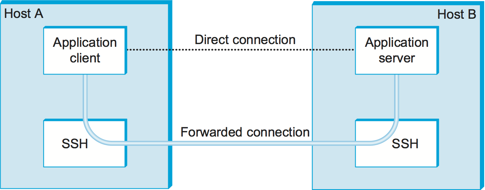

# {{Paj.Toe}}

在这一点上,我们已经看到了许多需要提供一个或两个方面的安全性的组件. 这些组件包括密码算法ㄡ密钥预分配机制和认证协议. 在本节中,我们将研究使用这些组件的一些完整系统. 

这些系统可以由它们操作的协议层大致分类. 在应用层操作的系统包括提供电子邮件安全性的"相当好的隐私" (PGP) 和安全远程登录工具"安全外壳" (SSH) . 在传输层,有IETF的传输层安全性 (Transport Layer Security,TLS) 标准和它派生的旧协议,安全套接字层 (Secure Socket Layer,SSL) . IPSec (IP安全) 协议,顾名思义,在IP (网络) 层工作. 802.11i在无线网络的链路层提供安全性. 本节描述了这些方法中的每一个的显著特征. 

你可能会奇怪为什么必须在这么多不同的层次上提供安全性. 原因之一是不同的威胁需要不同的防御措施,这通常转化为保护不同的协议层. 例如,如果您主要关心的是隔壁大楼中的人在您的笔记本电脑与802.11接入点之间流动时窥探您的通信量,那么您可能需要链接层的安全性. 然而,如果你想确定你已经连接到了银行的网站,并且阻止你发送给银行的所有数据被一些互联网服务提供商的好奇的雇员阅读,那么一些东西就会从你的机器一直延伸到银行的服务器,比如tra. NCAPE层可能是确保交通安全的合适场所. 通常情况下,没有一个一刀切的解决方案. 

下面描述的安全系统具有改变它们使用的密码算法的能力. 使安全系统算法独立是一个非常好的想法,因为您永远不知道您最喜爱的密码算法何时可能被证明不够强大. 如果您可以快速地更改为新算法,而不必更改协议规范或实现,那就太好了. 请注意,这与能够在不改变算法的情况下更改密钥类似;如果您的密码算法之一被发现有缺陷,那么如果您的整个安全体系结构不需要立即重新设计,那将是非常棒的. 

## 相当好的隐私 (PGP) 

相当好的隐私 (PGP) 是一种广泛使用的方法来提供电子邮件的安全性. 它提供身份验证ㄡ机密性ㄡ数据完整性和不可否认性. 最初由Phil Zimmerman设计,它已经演变成IETF标准称为OpenPGP. 正如我们在前一节中看到的,PGP值得注意的是,它使用了"信任网络"模型来分发密钥,而不是树状层次结构. 

PGP的机密性和接收方认证取决于电子邮件消息的接收方,该电子邮件消息具有发送方已知的公钥. 为了提供发送方身份验证和不可否认性,发送方必须具有接收方已知的公钥. 这些公钥使用证书和信任PKI网络进行预分配. PGP支持公钥证书的RSA和DSS. 这些证书还可以指定密钥所有者支持或优选的密码算法. 证书提供电子邮件地址和公钥之间的绑定. 

<figure class="line">
	<a id="pgpMessage"></a>
	
	<figcaption>PGP's steps to prepare a message for emailing from 
	Alice to Bob.</figcaption>
</figure>

考虑下面的PGP示例,用于提供发送方身份验证和机密性. 假设爱丽丝有一个邮件给鲍伯. 爱丽丝的PGP应用程序通过[图1](#pgpMessage). 首先,消息由Alice进行数字签名;MD5ㄡSHA-1和SHA-2系列是可用于数字签名的散列之一. 然后,她的PGP应用程序为这一条消息生成一个新的会话密钥;AES和3DES是支持的对称密钥密码之一. 使用会话密钥对数字签名的消息进行加密,然后使用鲍伯的公钥对会话密钥本身进行加密并附加到消息. 爱丽丝的PGP应用程序提醒她,她曾分配给鲍伯的公钥的信任级别,基于她对鲍伯的证书数量和签署证书的个人的可信度. 最后,不是为了安全,而是因为电子邮件必须在ASCII中发送,所以将一个Base64编码应用到消息中,以将其转换为ASCII兼容表示. 在接收到电子邮件中的PGP消息时,鲍伯的PGP应用程序逐步地对该过程进行反向操作,以获得原始明文消息并确认爱丽丝的数字签名,并提醒鲍伯爱丽丝爱丽丝公钥中的信任级别. 

电子邮件具有特殊的特性,允许PGP在这一个消息数据链中嵌入适当的认证协议. 

前面的讨论给出了一个很好的例子,说明为什么应用层安全机制是有帮助的. 只有充分了解了应用程序如何工作,您才能正确地选择要防御哪些攻击 (如伪造电子邮件) 和忽略哪些攻击 (如延迟或重放电子邮件) . 

## 安全壳 (SSH) 

安全外壳 (SSH) 协议用于提供远程登录服务,并且旨在替换在因特网早期使用的安全性较低的Telnet和rlogin程序.  (SSH还可以用于远程执行命令和传输文件,如UNIX) . `rsh`和`rcp`分别是命令,但我们将首先关注SSH如何支持远程登录. ) SSH最常用于提供强客户端/服务器身份验证/消息完整性,其中SSH客户端在用户的桌面计算机上运行,SSH服务器在用户希望的远程计算机上运行登录,但它也支持机密性. Telnet和RLogin不提供这些能力. 注意,"SSH"通常用来指SSH协议和使用它的应用程序;您需要从上下文中找出哪一个. 

为了更好地理解SSH在当今互联网上的重要性,可以考虑使用它的几个场景. 例如,远程通勤者经常订阅提供高速电缆调制解调器或DSL服务的ISP,并且他们使用这些ISP,以及一些其他ISP链,以到达其雇主操作的机器. 这意味着当一个远程工作者登录到他雇主数据中心内的一台机器时,密码和发送或接收的所有数据都可能通过任何数量的不可信网络. SSH提供了一种方法来加密通过这些连接发送的数据,并改进用于登录的认证机制的强度. SSH的类似用法是远程登录到路由器,也许是为了更改其配置或读取其日志文件;显然,网络管理员希望确保能够安全地登录到路由器,并且未经授权的当事方既不能登录也不能拦截发送到路由器或UTPT发送给管理员. 

最新版本的SSH,版本2,由三个协议组成: 

-   传输层协议SSH-TRON

-   SSH-AUTH,一种认证协议

-   SSH-CONN,一种连接协议

我们专注于前两个,这涉及到远程登录. 在本节结束时,我们将简要讨论SSH-CONN的目的. 

SSH-TRON在客户端和服务器机器之间提供加密通道. 它运行在TCP连接的顶部. 每当用户使用SSH应用程序登录到远程计算机时,第一步就是在这两台计算机之间建立SSH-TRANS通道. 这两台机器首先通过客户端使用RSA认证服务器来建立这个安全通道. 一旦被认证,客户端和服务器建立会话密钥,它们将用于加密通过信道发送的任何数据. 这个高层描述略过了几个细节,包括SSH-TRANS协议包括双方将要使用的加密算法的协商. 例如,通常选择AES. 此外,SSH-TRON包括通过信道交换的所有数据的消息完整性检查. 

我们不能略过的一个问题是,客户机如何拥有需要对服务器进行身份验证的服务器的公钥. 奇怪的是,服务器在连接时告诉客户端它的公钥. 当客户机第一次连接到特定的服务器时,SSH应用程序警告用户它以前从未与此计算机通信,并询问用户是否希望继续. 尽管这样做是危险的,但是因为SSH实际上不能对服务器进行身份验证,所以用户经常对这个问题说"是". 然后,SSH应用程序记住服务器的公钥,下次用户连接到同一台机器时,它将这个保存的密钥与服务器响应的密钥进行比较. 如果它们是相同的,SSH对服务器进行身份验证. 但是,如果它们不同,SSH应用程序再次警告用户有问题,然后给用户一个中止连接的机会. 或者,审慎的用户可以通过一些带外机制学习服务器的公钥,将其保存在客户机上,因此不会冒"第一次"的风险. 

一旦SSH-TRANS通道存在,下一步就是让用户实际登录到计算机中,或者更具体地说,向服务器验证自己或自己. SSH允许三种不同的机制来执行此操作. 首先,由于两台机器是通过安全通道进行通信的,所以用户只需向服务器发送他或她的密码就可以了. 在使用Telnet时这样做并不安全,因为密码将以明文发送,但是在SSH的情况下,密码在SSH-TRANS通道中加密. 第二种机制使用公钥加密. 这就要求用户已经将他或她的公钥放到服务器上. 第三种机制,叫做*基于主机的认证*基本上说,任何声称来自某组可信主机的用户自动被认为是服务器上的同一用户. 基于主机的身份验证需要客户端*主办*在服务器首次连接时对服务器进行身份验证;标准SSH-TRON只在默认情况下对服务器进行身份验证. 

您应该从这个讨论中得到的主要信息是,SSH是我们在本章中看到的协议和算法的一个相当简单的应用. 然而,有时让SSH成为需要理解的挑战的是用户必须创建和管理的所有密钥,其中确切的接口依赖于操作系统. 例如,在大多数Unix机器上运行的OpenSSH包支持可用于创建公钥/私钥对的命令. 然后将这些密钥存储在用户的主目录中的目录中的各种文件中. 例如,文件`~/.ssh/known_hosts`记录用户登录到的所有主机的密钥,文件`~/.ssh/authorized_keys`包含当用户登录到此计算机时验证用户所需的公钥 (即,它们在服务器端使用) ,并且文件包含验证远程计算机上的用户所需的私钥 (即,它们在客户端使用) . 

<figure class="line">
	<a id="ssh-tunnel"></a>
	
	<figcaption>Using SSH port forwarding to secure other TCP-based
	applications.</figcaption>
</figure>

最后,SSH被证明是安全远程登录的系统,它已经被扩展到支持其他应用程序,例如发送和接收电子邮件. 其想法是在安全的"SSH隧道"上运行这些应用程序. *端口转发*,并且使用SSH-CONN协议. 这个想法在[图2](#ssh-tunnel)其中,我们看到主机A上的客户端通过SSH连接转发其流量,从而与主机B上的服务器间接通信. 这种机制被称为*端口转发*因为当消息到达服务器上众所周知的SSH端口时,SSH首先解密内容,然后将数据"转发"到服务器正在侦听的实际端口. 这只是另一种隧道,在这种情况下,它提供机密性和认证. 这样可以使用SSH隧道提供一种虚拟专用网 (VPN) 的形式. 

## 传输层安全 (TLS,SSL,HTTPS) 

为了理解传输层安全性 (TLS) 标准和TLS所基于的安全套接字层 (SSL) 的设计目标和要求,考虑它们要解决的主要问题之一是有帮助的. 随着万维网的兴起和商业企业开始对它感兴趣,很明显,在网络上交易一定程度的安全是必要的. 典型的例子就是用信用卡购物. 当你把信用卡信息发送到网络上的计算机时,有几个问题值得关注. 首先,你可能担心这些信息会在运输过程中被截获,随后被用来进行未经授权的采购. 您还可能担心修改事务的细节,例如更改购买金额. 你当然想知道,你发送信用卡信息的计算机实际上是属于卖方的,而不是其他的. 因此,我们立即看到在Web事务中需要保密性ㄡ完整性和认证. 第一个广泛使用的解决方案是SSL,最初是由Netscape开发的,随后是IETF的TLS标准的基础. 

SSL和TLS的设计者认识到这些问题并不特定于Web事务 (即,使用HTTP的那些事务) ,而是构建了一个通用协议,该协议位于诸如HTTP之类的应用协议和诸如TCP之类的传输协议之间. 调用这个"传输层安全性"的原因在于,从应用程序的角度来看,这个协议层看起来就像一个普通的传输协议,只是它是安全的. 也就是说,发送者可以打开连接并为传输传递字节,并且安全传输层将使用必要的机密性ㄡ完整性和身份验证将它们传送到接收器. 通过在TCP上运行安全传输层,TCP的所有常规特性 (可靠性ㄡ流量控制ㄡ拥塞控制等) 也提供给应用程序. 协议层的这种安排被描述为[图3](#tls-stack).

<figure class="line">
	<a id="tls-stack"></a>
	
	<figcaption>Secure transport layer inserted between application
	and TCP layers.</figcaption>
</figure>

当HTTP以这种方式使用时,它被称为HTTPS (安全HTTP) . 事实上,HTTP本身没有变化. 它只是传递数据并接受来自SSL/TLS层而不是TCP的数据. 为了方便起见,已将默认TCP端口分配给HTTPS (443) . 也就是说,如果您试图连接到TCP端口443上的服务器,您很可能会发现自己正在与SSL/TLS协议进行通信,如果身份验证和解密一切正常,SSL/TLS协议会将您的数据传递给HTTP. 虽然SSL/TLS的独立实现是可用的,但是将实现与需要它的应用程序 (主要是Web浏览器) 绑定在一起更为常见. 

在我们讨论的传输层安全的其余部分,我们专注于TLS. 虽然SSL和TLS不幸地不能互操作,但是它们仅在一些小的方面有所不同,因此几乎所有对TLS的描述都适用于SSL. 

### 握手协议

一对TLS参与者在运行时协商要使用的密码. 参与者协商选择: 

-   用于实现HMACS的数据完整性哈希 (MD5,SHA-1等) 

-   机密密钥的对称密钥 (其中的可能性是DESㄡ3DES和AES) 

-   会话密钥建立方法 (其中有.ie-Hellmanㄡ固定.ie-Hellman和使用RSA或DSS的公钥认证协议) 

有趣的是,参与者还可以协商使用压缩算法,这并不是因为它提供了任何安全好处,而是因为当您在谈判所有其他内容时很容易做到,并且您已经决定对数据进行一些昂贵的每字节操作. 

在TLS中,机密密码使用两个密钥,一个用于每个方向,并且类似地使用两个初始化向量. HMACS同样为两个参与者键入不同的键. 因此,不管密码和散列的选择,TLS会话都需要有效的六个密钥. TLS从单个共享中导出它们. *主秘*. 主秘密是一个384位 (48字节) 的值,该值反过来部分源自TLS的会话密钥建立协议产生的"会话密钥". 

TLS通过协商选择并建立共享主密钥的部分称为*握手协议*.  (实际数据传输由TLS) 执行. *记录协议*握手协议在本质上是一种会话密钥建立协议,具有主密钥而不是会话密钥. 由于TLS支持会话密钥建立方法的选择,因此需要相应的不同协议变体. 此外,握手协议支持在两个参与者的相互认证ㄡ仅一个参与者的认证 (这是最常见的情况,例如认证网站但不是用户) 或者根本不认证 (匿名.ie-Hellman) 之间进行选择. 因此,握手协议将多个会话密钥建立协议编织成单个协议. 

[图4](#tls-hand)显示高级别的握手协议. 客户机首先按优先顺序递减地发送它所支持的密码算法的组合的列表. 服务器响应,给出从客户端列出的加密算法的单一组合. 这些消息也包含一个*客户端随机数*和A*服务器随机数*分别在以后生成主密钥时被合并. 

<figure class="line">
	<a id="tls-hand"></a>
	
	<figcaption>Handshake protocol to establish TLS session.</figcaption>
</figure>

此时,协商阶段已经完成. 服务器现在基于协商的会话密钥建立协议发送附加消息. 这可能涉及到发送公钥证书或一组Diffie-Hellman参数. 如果服务器需要对客户端进行身份验证,它会发送一个单独的消息来指示. 然后客户端用协商密钥交换协议的一部分进行响应. 

现在客户端和服务器都有生成主密钥所必需的信息. 他们交换的"会话密钥"实际上不是一个密钥,而是TLS称之为的密钥. *主秘密*. 主秘密是从这个主密钥ㄡ客户端随机数和服务器随机数计算出来的 (使用已发布的算法) . 使用从主秘密派生的密钥,客户机然后发送一个消息,该消息包括前面所有握手消息的散列,服务器用类似的消息对此作出响应. 这使它们能够检测它们发送和接收的握手消息之间的任何差异,例如,如果中间的人修改了初始未加密的客户端消息以削弱其对密码算法的选择,就会产生这样的结果. 

### 记录协议

在握手协议建立的会话中,TLS的记录协议为底层传输服务增加了机密性和完整性. 从应用层传来的消息是: 

1.  分割或合并成方便大小的块,用于以下步骤

2.  可选压缩

3.  使用HMAC保护完整性

4.  使用对称密钥密码加密

5.  传输到传输层 (通常为TCP) 用于传输

记录协议使用HMAC作为认证器. HMAC使用参与者散列的任意散列算法 (MD5ㄡSHA-1等) . 客户端和服务器在计算HMAC时使用不同的密钥,使得它们更难被破解. 此外,每个记录协议消息被分配一个序列号,在计算HMAC时包括该序列号,即使该序列号在消息中从未显式显示. 此隐式序列号防止消息重放或重新排序. 这是需要的,因为尽管TCP可以在正常假设下向其上层递送顺序的ㄡ未复制的消息,但是这些假设不包括可以拦截TCP消息ㄡ修改消息或发送虚假消息的对手. 另一方面,正是TCP的传递保证,使得TLS能够依赖于合法的TLS消息,该消息具有下一个隐式序列号. 

TLS协议的另一个有趣的特性,对于Web事务来说是非常有用的特性,就是恢复会话的能力. 为了理解这一动机,了解HTTP如何使用TCP连接是有帮助的.  (在下一章中将介绍HTTP的细节. ) 每个HTTP操作,例如从服务器获取文本页或图像,都需要打开新的TCP连接. 使用多个嵌入式图形对象检索单个页面可能需要很多TCP连接. 在数据传输开始之前,打开TCP连接需要三路握手. 一旦TCP连接准备好接受数据,客户机就需要启动TLS握手协议,在发送实际应用程序数据之前至少再花两次往返时间 (并消耗一些处理资源和网络带宽) . TLS的恢复能力减轻了这个问题. 

会话恢复是对握手的优化,可以在客户端和服务器过去已经建立了一些共享状态的情况下使用. 客户端在初始握手消息中简单地包含来自先前建立的会话的会话ID. 如果服务器发现它仍然具有该会话的状态,并且在最初创建该会话时协商了恢复选项,那么服务器可以向客户端回复成功的指示,并且数据传输可以开始使用先前的nego算法和参数. 平淡的如果会话ID与服务器上缓存的任何会话状态不匹配,或者如果会话不允许恢复,则服务器将返回到正常的握手过程. 

## IP安全 (IPSec) 

也许最有雄心壮志的将安全融入互联网的所有努力都发生在IP层. 支持IPsec的体系结构在IPv4中是可选的,但在IPv6中是强制性的. 

IPsec实际上是一个框架 (与单个协议或系统相反) ,用于提供本章中讨论的所有安全服务. IPSec提供三个自由度. 首先,它是高度模块化的,允许用户 (或者更可能的系统管理员) 从多种密码算法和专门的安全协议中进行选择. 其次,IPsec允许用户从安全属性的大菜单中进行选择,包括访问控制ㄡ完整性ㄡ身份验证ㄡ原创性和机密性. 第三,IPsec可用于保护窄流 (例如,属于一对主机之间正在发送的特定TCP连接的分组) 或宽流 (例如,在一对路由器之间流动的所有分组) . 

从高层次看,IPSec由两部分组成. 第一部分是实现可用安全服务的一对协议. 它们是身份验证头 (AH) ,它提供访问控制ㄡ无连接消息完整性ㄡ身份验证和反重放保护,以及封装安全有效载荷 (ESP) ,它支持这些相同的服务,以及保密性. 很少使用,所以我们把重点放在ESP这里. 第二部分是对密钥管理的支持,它适合于一个称为Internet安全协会和密钥管理协议 (ISAKMP) 的总协议. 

将这两个部分绑定在一起的抽象是*安全关联* (SA) . SA是与可用安全属性中的一个或多个单纯形 (单向) 连接. 确保一对主机之间的双向通信 (例如,对应于TCP连接) 需要两个SA,每个方向一个. 虽然IP是无连接协议,但安全性取决于诸如密钥和序列号之类的连接状态信息. 当创建时,SA被分配一个ID号,称为*安全参数索引* (SPI) 由接收机组成. 该SPI和目的IP地址的组合唯一地标识SA. ESP报头包括SPI,因此接收主机可以确定传入分组属于哪个SA,从而确定将哪些算法和密钥应用于分组. 

SAS是使用ISAKMP建立ㄡ协商ㄡ修改和删除的. 它定义了用于交换密钥生成和认证数据的分组格式. 这些格式并不特别有趣,因为它们只提供一个框架ℴℴ密钥和身份验证数据的确切形式取决于所使用的密钥生成技术ㄡ密码和身份验证机制. 此外,ISAKMP没有指定特定的密钥交换协议,尽管它确实建议将Internet密钥交换(IKE)作为一种可能性,并且在实践中使用IKE. 

ESP是用于安全地在已建立的SA上传输数据的协议. 在IPv4中,ESP报头遵循IP报头;在IPv6中,它是一个扩展报头. 它的格式同时使用标题和预告片,如[图5](#esp). 这个`SPI`字段允许接收主机识别数据包所属的安全关联. 这个`SeqNum`字段防止重放攻击. 包的`PayloadData`包含由`NextHdr`字段. 如果选择了机密性,则使用与SA相关联的任何密码对数据进行加密. 这个`PadLength`字段记录向数据添加了多少填充;有时需要填充,因为例如,密码要求明文是特定数量的字节的倍数,或者确保生成的密文终止于4字节的边界. 最后,`AuthenticationData`携带验证者. 

<figure class="line">
	<a id="esp"></a>
	
	<figcaption>IPSec's ESP format.</figcaption>
</figure>

IPSec支持*隧道模式*以及更直截了当*运输方式*. 每个SA在一个或另一个模式下操作. 在传输模式SA中,ESP的有效载荷数据仅仅是用于更高层的消息,例如UDP或TCP. 在这种模式下,IPSec充当中间协议层,就像TCP/TLS在TCP和更高层之间一样. 当接收到ESP消息时,其有效载荷被传递到更高级别的协议. 

然而,在隧道模式SA中,ESP的有效载荷数据本身是IP分组,如[图6](#espTunnelPacket). 该内部IP分组的源和目的地可以不同于外部IP分组的源和目的地. 当接收到ESP消息时,其有效载荷被转发为正常IP分组. 使用ESP最常用的方式是在两个路由器之间建立一个"IPSec隧道",通常是防火墙. 例如,希望使用因特网链接两个站点的公司可以在一个站点的路由器和另一个站点的路由器之间打开一对隧道模式SA. 从一个站点输出的IP分组在传出路由器处将成为发送到另一个站点的路由器的ESP消息的有效负载. 接收路由器将打开有效载荷IP包并将其转发到其真正目的地. 

<figure class="line">
	<a id="espTunnelPacket"></a>
	
	<figcaption>An IP packet with a nested IP packet encapsulated
	using ESP in tunnel mode. Note that the inner and outer packets have
	different addresses.</figcaption>
</figure>

这些隧道还可以被配置成使用具有保密性和认证的ESP,从而防止对穿过该虚拟链路的数据的未经授权的访问,并确保在隧道的远端没有接收到虚假数据. 此外,隧道可以提供流量机密性,因为通过单个隧道复用多个流模糊了关于在特定端点之间流了多少流量的信息. 这样的隧道的网络可以用来实现整个虚拟专用网络. 在VPN上进行通信的主机甚至不需要知道它存在. 

## 无线安全 (802.11i) 

由于缺乏介质上的任何物理安全性,无线链路特别暴露于安全威胁. 虽然802.11的便利性已经促使该技术被广泛接受,但是缺乏安全性一直是一个反复出现的问题. 例如,公司的雇员将802.11个接入点连接到公司网络太容易了. 由于无线电波通过大多数墙,如果接入点缺乏正确的安全措施,攻击者现在可以从建筑物外部获得对公司网络的访问. 类似地,在建筑物内部具有无线网络适配器的计算机可以连接到建筑物外部的接入点,可能使其受到攻击,更不用说,如果同一台计算机也具有以太网连接,则公司网络的其他部分也会受到攻击. 

因此,在确保Wi-Fi链路方面已经有相当多的工作. 有点令人惊讶的是,为802.11开发的早期安全技术之一,称为有线等效隐私 (Wired Equi.t Privacy,WEP) ,被证明存在严重缺陷,并且很容易损坏. 

IEEE 802.11i标准在链路层向802.11 (Wi-Fi) 提供认证ㄡ消息完整性和机密性. *WPA2*(Wi-Fi受保护接入2)通常用作802.11i的同义词,尽管从技术上讲,它是Wi-Fi联盟的一个商标,证明产品符合802.11i. 

为了向后兼容,802.11i包括第一代安全算法 (包括WEP) 的定义,这些算法现在已知具有重大安全缺陷. 我们将关注802.11i的更新ㄡ更强的算法. 

802.11i认证支持两种模式. 在任一模式中,成功认证的最终结果是共享成对的主密钥. *个人模式*也称为*预共享密钥 (PSK) 模式*,提供更弱的安全性,但对于家庭802.11网络这样的情况来说更方便和更经济. 无线设备和接入点 (AP) 具有共享的预配置. *口令*-基本上是一个非常长的密码,从该密码中导出成对的主密钥. 

802.11i的更强的认证模式基于用于控制对LAN的访问的IEEE 802.1X框架,该框架使用认证服务器(AS),如[图7](#AuthenServer). AS和AP必须通过安全通道连接,甚至可以实现为单个盒子,但是它们在逻辑上是分开的. AP在无线设备和AS之间转发认证消息. 用于认证的协议称为*扩展认证协议* (EAP) . EAP被设计成支持多种身份验证方法ℴℴ智能卡ㄡKerberosㄡ一次性密码ㄡ公钥身份验证等等ℴℴ以及单侧和相互身份验证. 因此,EAP被认为是一个认证框架而不是一个协议. 特定的EAP兼容协议,其中有很多,被称为*EAP方法*. 例如,EAP-TLS是基于TLS认证的EAP方法. 

<figure class="line">
	<a id="AuthenServer"></a>
	
	<figcaption>Use of an Authentication Server in 802.11i.</figcaption>
</figure>

802.11i对EAP方法可以用作认证的基础没有任何限制. 然而,它确实需要执行EAP的方法. *相互的*认证,因为我们不仅要防止对手通过我们的AP访问网络,我们还要防止对手用假的ㄡ恶意的AP欺骗我们的无线设备. 成功的认证的最终结果是在无线设备和AS之间共享的成对主密钥,然后AS将该密钥传送给AP. 

较强基于AS的模式和较弱的个人模式之间的主要区别之一是,前者很容易支持每个客户端的唯一密钥. 这反过来又使更改可以验证自己的客户端集 (例如,撤销对一个客户端的访问) 变得更加容易,而无需更改存储在每个客户端中的秘密. 

手持成对主密钥,无线设备和AP执行称为四向握手的会话密钥建立协议,以建立成对瞬时密钥. 这个成对的瞬态密钥实际上是包含一个会话密钥的密钥集合,称为*时态密钥*. 该会话密钥由协议使用,称为*CCMP*,它提供802.11i的数据机密性和完整性. 

CCMP采用CBC-MAC (密码块链接和消息认证码) 协议来表示CTR (计数器模式) . CCMP在计数器模式下使用AES加密机密性. 回想一下,在计数器模式下,将计数器的连续值合并到明文的连续块的加密中. 

CCMP使用消息认证码 (MAC) 作为认证器. MAC算法是基于CBC的,即使CCMP在保密性加密中不使用CBC. 实际上,CBC是在不传输任何CBC加密块的情况下执行的,仅使得最后一个CBC加密块可以用作MAC (实际上只使用它的前8个字节) . 初始化向量的作用由特别构造的第一块来扮演,该第一块包括48位分组编号-序列号. (分组号码也包含在保密性加密中,用于暴露重放攻击. )MAC随后与明文一起被加密,以防止生日攻击,这取决于使用相同的认证器找到不同的消息. 

## 防火墙

虽然本章的大部分内容都集中在使用密码来提供诸如身份验证和保密之类的安全特性上,但是存在一整套安全问题不容易通过密码手段解决. 例如,蠕虫和病毒通过利用操作系统和应用程序中的bug传播 (有时也包括人的易受骗性) ,如果计算机有未修补的漏洞,那么任何加密都无法帮助您. 因此,其他方法经常被用来避免各种形式的潜在有害交通. 防火墙是最常见的方法之一. 

防火墙是一个系统,通常位于它所保护的站点和网络的其他部分之间的连接的某个点上,如下所示[图8](#firewall). 它通常被实现为"设备"或路由器的一部分,尽管"个人防火墙"可以在最终用户机器上实现. 基于防火墙的安全性取决于防火墙是从外部到站点的唯一连接;不应该通过其他网关ㄡ无线连接或拨号连接绕过防火墙. 墙上的比喻在网络环境中有点误导,因为大量的交通通过防火墙. 一种考虑防火墙的方法是,默认情况下它阻止流量,除非允许特定的流量通过. 例如,它可能过滤掉所有传入消息,除了特定IP地址集或特定TCP端口号的那些地址. 

<figure class="line">
	<a id="firewall"></a>
	
	<figcaption>A firewall filters packets flowing between a site and
	the rest of the Internet.</figcaption>
</figure>

实际上,防火墙将网络划分为防火墙内部的更信任区域和防火墙外部的不信任区域. 如果您不希望外部用户访问您站点中的特定主机或服务,那么这是有用的. 很多复杂性都源于这样一个事实,即您希望允许不同类型的访问不同外部用户,从普通公众ㄡ业务合作伙伴到组织远程定位的成员. 防火墙还可以对传出通信量施加限制,以防止某些攻击,并且如果对手成功地进入防火墙内部,则限制损失. 

> 防火墙的位置通常也是全局可寻址区域和使用本地地址区域之间的分界线. 因此,网络地址转换 (NAT) 功能和防火墙功能常常在同一个设备中发现,即使它们在逻辑上是分开的. 

防火墙可以用来创建多个*信任区*,比如一个越来越可信的区域的层次结构. 一个常见的安排涉及信任的三个区域: 内部网络,*二甲基亚砜* ("非军事区") 和互联网的其余部分. 该DMZ用于保存需要访问的DNS和电子邮件服务器等服务. 内部网络和外部世界都可以访问DMZ,但是DMZ中的主机不能访问内部网络;因此,成功破坏暴露DMZ中的主机的对手仍然不能访问内部网络. 该DZ可定期恢复到清洁状态. 

防火墙基于IPㄡTCP和UDP信息等. 它们配置了一个地址表,这些表表征了它们将要转发的数据包,而不会转发. 通过地址,我们指的不仅仅是目的地的IP地址,尽管这是一种可能性. 通常,表中的每个条目都是4元组: 它给出源和目的地的IP地址和TCP (或UDP) 端口号. 

例如,防火墙可以被配置为过滤 (不转发) 与以下描述相匹配的所有分组: 

```pseudo
(192.12.13.14, 1234, 128.7.6.5, 80)
```

这种模式表示从主机122.123.14的端口1234丢弃所有主机上的主机1287.7.5端口80的所有数据包.  (端口80是HTTP的众所周知的TCP端口. ) 当然,命名每个要过滤其数据包的源主机通常是不实际的,因此模式可以包括通配符. 例如,

```pseudo
(*,  *, 128.7.6.5, 80)
```

说,过滤掉所有在1287.7.5上被发送到端口80的包,而不管源主机或端口发送了包. 请注意,像这样的地址模式要求防火墙根据4级端口号以及3级主机地址作出转发/过滤决策. 正是由于这个原因,网络层防火墙有时被称为*4级开关*.

在前面的讨论中,防火墙转发除了特别指示过滤某些类型的数据包之外的所有内容. 防火墙也可以过滤掉所有的东西,除非明确指示转发它,或者使用这两种策略的混合. 例如,可以指示防火墙仅允许访问特定邮件服务器上的端口25 (SMTP邮件端口) ,而不是阻止对主机128.7.6.5上的端口80的访问,例如

```pseudo
(*,  *, 128.19.20.21, 25)
```

但阻止所有其他交通. 经验表明防火墙经常被错误地配置,允许不安全的访问. 问题的一部分是过滤规则可以以复杂的方式重叠,使得系统管理员难以正确地表达预期的过滤. 最大化安全性的设计原则是配置防火墙以丢弃除显式允许的所有分组之外的所有分组. 当然,这意味着一些有效的应用程序可能被意外地禁用;大概这些应用程序的用户最终会通知并要求系统管理员做出适当的更改. 

许多客户机/服务器应用程序动态地将端口分配给客户机. 如果防火墙内的客户端启动对外部服务器的访问,则服务器的响应将被寻址到动态分配的端口. 这就提出了一个问题: 防火墙如何配置成允许任意服务器的响应包,但不允许没有客户机请求的类似包?这是不可能的*乏态防火墙*,它对每个分组进行隔离评估. 它需要一个*状态防火墙*,它跟踪每个连接的状态. 然后,只有当它是在该端口上连接的当前状态中的有效响应时,才允许寻址到动态分配端口的传入分组. 

现代防火墙也基于许多特定的应用层协议 (如HTTPㄡTELNET或FTP) 来理解和过滤. 它们使用特定于该协议的信息,例如HTTP情况下的URL,以决定是否丢弃消息. 

### 防火墙的优缺点

最好的情况是,防火墙保护网络免受来自Internet其他部分的不希望的访问;它不能为防火墙内部和外部之间的合法通信提供安全性. 相反,本章中描述的基于密码的安全机制能够在任何地方的任何参与者之间提供安全通信. 既然如此,为什么防火墙如此普遍?一个原因是,可以使用成熟的商业产品单方面部署防火墙,而基于密码的安全性需要在通信的两个端点提供支持. 防火墙占主导地位的一个更根本的原因是,它们将安全性封装在集中的位置,实际上将安全性从网络的其他部分分解出来. 系统管理员可以管理防火墙来提供安全性,使防火墙内的用户和应用程序免于安全顾虑,至少免于某些类型的安全顾虑. 

不幸的是,防火墙有严重的局限性. 由于防火墙不限制防火墙内的主机之间的通信,因此设法在站点内部运行代码的对手可以访问所有本地主机. 对手如何进入防火墙?对手可以是具有合法访问权限的不满员工,或者对手的软件可能隐藏在从CD安装或从Web下载的一些软件中. 通过使用无线通信或拨号连接可以绕过防火墙. 

另一个问题是,通过防火墙授予访问权限的任何方 (如业务合作伙伴或外部员工) 都成为安全漏洞. 如果他们的安全不如你的好,那么对手可以穿透你的安全,穿透他们的安全. 

防火墙最严重的问题是防火墙对机器内部漏洞的漏洞. 这样的bug经常被发现,所以系统管理员必须经常监视它们的公告. 管理员经常不能这样做,因为防火墙安全漏洞通常利用已知一段时间并具有直接解决方案的安全缺陷. 

*恶意软件* (用于"恶意软件") 是被设计成以计算机用户隐藏和不希望的方式在计算机上操作的软件的术语. 病毒ㄡ蠕虫和间谍软件是恶意软件的常见类型.  (*病毒*有时用同义词*恶意软件*但是,我们将在更狭义的意义上使用它,在这种意义上,它只指一种特定的恶意软件. )恶意代码不需要是本地可执行的对象代码;它还可以是解释代码,如脚本或可执行的宏,如Microsoft Word所使用的那些. 

*病毒*和*蠕虫*它们的区别在于蠕虫是复制自身的完整程序,而病毒是插入 (并插入自身的副本) 到另一软件或文件中的一点代码,因此它是作为执行该软件的一部分或打开文件的结果. 病毒和蠕虫通常导致一些问题,例如消耗网络带宽,作为试图传播自身副本的副作用. 更糟的是,他们还可以故意破坏系统或破坏其安全的各种方式. 例如,他们可以安装一个*后门*-允许远程访问系统而不进行正常认证的软件. 这可能导致防火墙公开一个服务,该服务应该提供自己的身份验证过程,但是已经被后门破坏了. 

间谍软件是在没有授权的情况下收集和传输有关计算机系统或其用户的私有信息的软件. 通常间谍软件被秘密地嵌入其他有用的程序中,并由有意安装副本的用户传播. 防火墙的问题是私有信息的传输看起来像合法的通信. 

要问的一个自然问题是防火墙 (或密码安全) 是否可以首先将恶意软件排除在系统之外. 大多数恶意软件确实是通过网络传输的,尽管它也可以通过诸如CD和内存棒之类的便携式存储设备传输. 当然,这是支持许多管理员在其防火墙配置中采用的"阻止所有未明确允许的"方法的一个论点. 

一种用于检测恶意软件的方法是从已知的恶意软件中搜索代码段,有时称为*签名*. 这种方法有其自身的挑战,因为巧妙设计的恶意软件可以以各种方式调整其表示. 对网络进入的数据进行这样的详细检查也对网络性能产生潜在影响. 密码安全也不能消除该问题,尽管它确实提供了对软件片段的发起者进行身份验证并检测任何篡改的方法,例如当病毒插入其本身的副本时. 

与防火墙相关的是称为*入侵检测系统* (IDS) 和*入侵防御系统* (IPS) . 这些系统试图寻找异常活动,例如针对给定主机或端口号的异常大量的通信量,并为网络管理器生成警报,或者甚至可能采取直接行动来限制可能的攻击. 虽然在这个空间里有商业产品,但它仍然是一个发展的领域. 
